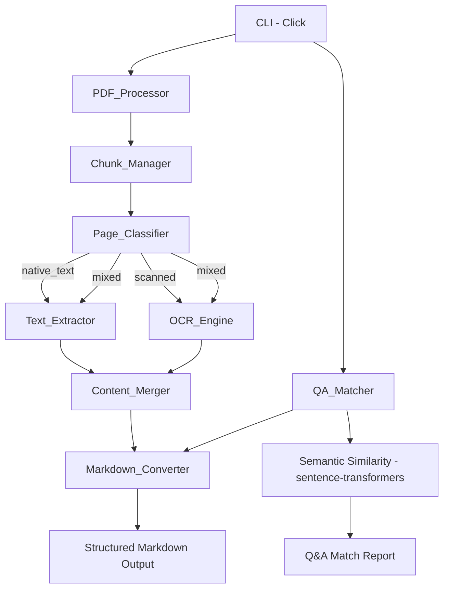

# Design Document: PDF-to-LLM Converter

## Overview

The PDF-to-LLM Converter is a Python CLI/library that extracts content from large, mixed-content PDF files and converts it to structured markdown for LLM consumption. It also supports a Q&A comparison workflow for legal document review.

The system is built around a pipeline architecture: PDF ingestion → page classification → content extraction (text + OCR) → markdown conversion → optional Q&A matching. Each stage is a discrete component with clear interfaces, enabling independent testing and replacement.

Key design decisions:
- **PyMuPDF (fitz)** for PDF parsing: fast, memory-efficient, supports both text extraction and image rendering without loading the full file.
- **Tesseract via pytesseract** for OCR: industry-standard, supports preprocessing pipelines, provides confidence scores.
- **sentence-transformers** for semantic similarity in Q&A matching: lightweight, runs locally, no API dependency.
- **Click** for CLI framework: clean, composable, well-documented.

## Architecture



### Processing Pipeline

1. CLI parses arguments and invokes `PDF_Processor.process(path, config)`.
2. `Chunk_Manager` yields page ranges (e.g., pages 0-49, 50-99, ...) to avoid loading the full document.
3. For each page in a chunk, `Page_Classifier` determines the content type.
4. Based on classification, `Text_Extractor` and/or `OCR_Engine` extract content.
5. For "mixed" pages, `Content_Merger` combines native text and OCR results, deduplicating overlapping regions.
6. `Markdown_Converter` transforms the extracted content into structured markdown with metadata.
7. Output is written to file or stdout.

For Q&A comparison:
1. Both PDFs are processed through the pipeline above.
2. The answers document is split into sections by detected headings.
3. `QA_Matcher` computes embeddings for each question and answer section using sentence-transformers.
4. Cosine similarity ranks answer sections per question.

## Components and Interfaces

### PDF_Processor

```python
@dataclass
class ProcessingConfig:
    chunk_size: int = 50
    ocr_threshold: float = 0.7
    verbose: bool = False

@dataclass
class ProcessingSummary:
    total_pages: int
    pages_processed: int
    pages_skipped: int
    warnings: list[str]
    processing_time_seconds: float

class PDFProcessor:
    def process(self, pdf_path: str, config: ProcessingConfig) -> tuple[Document, ProcessingSummary]:
        """Process a PDF file and return a Document model and summary."""
        ...
```

### Chunk_Manager

```python
class ChunkManager:
    def iter_chunks(self, pdf_path: str, chunk_size: int) -> Iterator[PageRange]:
        """Yield page ranges for chunked processing."""
        ...

@dataclass
class PageRange:
    start: int  # inclusive
    end: int    # exclusive
```

### Page_Classifier

```python
class PageClassification(Enum):
    NATIVE_TEXT = "native_text"
    SCANNED = "scanned"
    MIXED = "mixed"

class PageClassifier:
    def classify(self, page: fitz.Page) -> PageClassification:
        """Classify a page based on text coverage ratio."""
        ...
```

Classification logic:
- Compute `text_coverage = extractable_text_area / total_content_area`
- `text_coverage > 0.8` → NATIVE_TEXT
- `text_coverage < 0.2` → SCANNED
- Otherwise → MIXED

### Text_Extractor

```python
@dataclass
class ExtractedContent:
    body_text: str
    headers: list[str]
    footers: list[str]
    tables: list[Table]
    reading_order_blocks: list[TextBlock]

@dataclass
class TextBlock:
    text: str
    bbox: tuple[float, float, float, float]
    block_type: str  # "paragraph", "heading", "list_item", "table_cell"

@dataclass
class Table:
    rows: list[list[str]]

class TextExtractor:
    def extract(self, page: fitz.Page) -> ExtractedContent:
        """Extract native text preserving structure."""
        ...
```

Uses PyMuPDF's `page.get_text("dict")` for block-level extraction with bounding boxes, and `page.find_tables()` for table detection.

### OCR_Engine

```python
@dataclass
class OCRResult:
    text: str
    confidence: float
    blocks: list[TextBlock]

class OCREngine:
    def __init__(self, preprocessing: bool = True):
        self.preprocessing = preprocessing

    def ocr_page(self, page_image: Image.Image) -> OCRResult:
        """Run OCR on a page image with optional preprocessing."""
        ...

    def ocr_embedded_image(self, image: Image.Image) -> OCRResult:
        """Run OCR on an embedded image (stamp, annotation)."""
        ...
```

Preprocessing pipeline (via Pillow/OpenCV):
1. Convert to grayscale
2. Deskew (detect and correct rotation)
3. Contrast enhancement (adaptive histogram equalization)
4. Noise reduction (median filter)

Confidence is computed as the mean word-level confidence from Tesseract's `image_to_data` output.

### Content_Merger

```python
class ContentMerger:
    def merge(self, native: ExtractedContent, ocr: OCRResult) -> ExtractedContent:
        """Merge native text and OCR results, deduplicating overlaps."""
        ...
```

For "mixed" pages, the merger uses bounding box overlap detection. If a native text block and an OCR block overlap by more than 50% area, the native text block is preferred (higher fidelity). Non-overlapping OCR blocks are appended.

### Markdown_Converter

```python
@dataclass
class DocumentSection:
    title: str
    level: int  # 1-6
    content: str
    page_start: int
    page_end: int
    subsections: list["DocumentSection"]

@dataclass
class Document:
    sections: list[DocumentSection]
    pages: list[PageContent]

@dataclass
class PageContent:
    page_number: int
    classification: PageClassification
    content: ExtractedContent
    ocr_confidence: float | None

class MarkdownConverter:
    def to_markdown(self, document: Document) -> str:
        """Convert Document model to structured markdown string."""
        ...

    def from_markdown(self, markdown_str: str) -> Document:
        """Parse structured markdown back into a Document model."""
        ...
```

Output format:
```markdown
<!-- toc -->
- [Section Title](#section-title) (p. 1-5)
- [Another Section](#another-section) (p. 6-10)
<!-- /toc -->

<!-- page: 1 -->
<!-- section: Section Title -->
# Section Title

Body text here...

| Col A | Col B |
|-------|-------|
| val1  | val2  |

<!-- page: 2 -->
...
```

### QA_Matcher

```python
@dataclass
class QAMatch:
    question: str
    matches: list[MatchResult]
    is_unmatched: bool

@dataclass
class MatchResult:
    section_title: str
    page_range: tuple[int, int]
    similarity_score: float
    text_excerpt: str

class QAMatcher:
    def __init__(self, model_name: str = "all-MiniLM-L6-v2"):
        ...

    def match(
        self,
        questions: list[str],
        answer_sections: list[DocumentSection],
        top_n: int = 3,
        min_similarity: float = 0.5,
    ) -> list[QAMatch]:
        """Match questions to answer sections by semantic similarity."""
        ...
```

The matcher:
1. Encodes all questions and answer section texts into embeddings.
2. Computes cosine similarity matrix.
3. For each question, ranks sections by similarity and returns top N above threshold.

## Data Models

### Internal Document Model

```python
@dataclass
class Document:
    sections: list[DocumentSection]
    pages: list[PageContent]

@dataclass
class DocumentSection:
    title: str
    level: int
    content: str
    page_start: int
    page_end: int
    subsections: list["DocumentSection"]

@dataclass
class PageContent:
    page_number: int
    classification: PageClassification
    content: ExtractedContent
    ocr_confidence: float | None

@dataclass
class ExtractedContent:
    body_text: str
    headers: list[str]
    footers: list[str]
    tables: list[Table]
    reading_order_blocks: list[TextBlock]

@dataclass
class Table:
    rows: list[list[str]]

@dataclass
class TextBlock:
    text: str
    bbox: tuple[float, float, float, float]
    block_type: str
```

### Q&A Report Model

```python
@dataclass
class QAReport:
    questions: list[QAMatch]
    answers_source: str
    questions_source: str
    generated_at: str
```


## Correctness Properties

*A property is a characteristic or behavior that should hold true across all valid executions of a system — essentially, a formal statement about what the system should do. Properties serve as the bridge between human-readable specifications and machine-verifiable correctness guarantees.*

### Property 1: Chunk coverage is complete and disjoint

*For any* PDF with N pages and any chunk size C > 0, the page ranges produced by Chunk_Manager should be non-overlapping, cover every page from 0 to N-1 exactly once, and total ceil(N/C) chunks.

**Validates: Requirements 1.2**

### Property 2: Processing summary invariant

*For any* completed processing run, the summary should satisfy `pages_processed + pages_skipped == total_pages`, and `processing_time_seconds >= 0`.

**Validates: Requirements 1.5**

### Property 3: Page classification correctness by coverage ratio

*For any* text coverage ratio in [0.0, 1.0], the Page_Classifier should return NATIVE_TEXT when coverage > 0.8, SCANNED when coverage < 0.2, and MIXED otherwise. The output should always be one of exactly three valid classification values.

**Validates: Requirements 2.1, 2.2, 2.3, 2.4**

### Property 4: Extraction method routing matches classification

*For any* page classification, the PDF_Processor should invoke Text_Extractor for NATIVE_TEXT and MIXED pages, OCR_Engine for SCANNED and MIXED pages, and both extractors for MIXED pages.

**Validates: Requirements 2.5, 4.1**

### Property 5: OCR confidence score invariant

*For any* OCR result, the confidence score should be a float in the range [0.0, 1.0].

**Validates: Requirements 4.3**

### Property 6: Low-confidence OCR triggers warning

*For any* OCR result with a confidence score below the configured threshold, a warning should be logged containing the page number and the confidence score.

**Validates: Requirements 4.4**

### Property 7: Markdown renders all content types correctly

*For any* Document containing headings, tables, and lists, the markdown output should: map each heading of level L to a line starting with exactly L `#` characters; render each table preserving the original row count and column count; render each list preserving nesting depth and item count.

**Validates: Requirements 5.1, 5.2, 5.3, 5.4**

### Property 8: Markdown includes correct page and section metadata

*For any* Document with P pages and S sections, the markdown output should contain exactly P `<!-- page: N -->` comments with correct sequential page numbers, and exactly S `<!-- section: TITLE -->` comments matching the section titles.

**Validates: Requirements 5.5, 5.6**

### Property 9: Table of contents lists all sections

*For any* Document with sections, the generated table of contents should contain one entry per section, each entry including the section title and page reference, in document order.

**Validates: Requirements 5.7**

### Property 10: Document model serialization round-trip

*For any* valid Document model object, serializing to markdown via `to_markdown` then parsing back via `from_markdown` should produce an equivalent Document model object.

**Validates: Requirements 6.1, 6.2, 6.3**

### Property 11: Similarity scores are bounded

*For any* set of Q questions and S answer sections, the QA_Matcher should produce exactly Q × S similarity scores, each in the range [0.0, 1.0].

**Validates: Requirements 7.3**

### Property 12: QA match results are ranked, bounded, and complete

*For any* QA match result with configured top_n = N, each question's matches should be sorted by descending similarity score, contain at most N entries, and each match should include a non-empty section_title, a valid page_range tuple, a similarity_score in [0, 1], and a non-empty text_excerpt.

**Validates: Requirements 7.4, 7.5**

### Property 13: Unmatched questions are correctly flagged

*For any* question where all answer section similarity scores fall below the configured min_similarity threshold, the QAMatch result should have `is_unmatched == True` and an empty matches list.

**Validates: Requirements 7.6**

## Error Handling

| Scenario | Component | Behavior |
|---|---|---|
| File not found | CLI | Print error message to stderr, exit code 1 |
| Invalid PDF file | PDF_Processor | Print "not a valid PDF" to stderr, exit code 1 |
| Corrupted page | PDF_Processor | Log warning with page number, skip page, continue |
| OCR low confidence | OCR_Engine | Log warning with page number and score, continue |
| Missing Tesseract | CLI | Print "tesseract not found" with install instructions, exit code 1 |
| Missing Python dependency | CLI | Print missing package name with `pip install` command, exit code 1 |
| Memory pressure during chunk | Chunk_Manager | Process smaller chunks; configurable via `--chunk-size` |
| Empty PDF (0 pages) | PDF_Processor | Return empty Document with summary showing 0 pages |
| All pages skipped | PDF_Processor | Return empty Document, log warning that no content was extracted |

All errors write to stderr. Processing warnings are collected and summarized at the end. Non-zero exit codes signal failure to calling scripts.

## Testing Strategy

### Testing Framework

- **pytest** for test execution
- **Hypothesis** for property-based testing (minimum 100 examples per property)
- **pytest-mock** for mocking external dependencies (Tesseract, PyMuPDF)

### Property-Based Tests

Each correctness property from the design maps to a single Hypothesis test. Each test is annotated with:

```
# Feature: pdf-to-llm-converter, Property N: <property title>
# Validates: Requirements X.Y
```

Property tests use Hypothesis strategies to generate:
- Random page counts and chunk sizes (Property 1)
- Random processing summaries (Property 2)
- Random coverage ratios in [0.0, 1.0] (Property 3)
- Random page classifications (Property 4)
- Random confidence scores (Properties 5, 6)
- Random Document models with headings, tables, lists (Properties 7, 8, 9, 10)
- Random question/section sets with similarity scores (Properties 11, 12, 13)

### Unit Tests

Unit tests cover specific examples and edge cases:
- Invalid file paths and non-PDF files (Req 1.3)
- Corrupted page handling (Req 1.4)
- Table extraction with known table structures (Req 3.3)
- Header/footer tagging (Req 3.4)
- Embedded image OCR (Req 4.5)
- CLI command parsing and defaults (Req 8.1–8.9)
- Missing dependency detection (Req 9.4)

### Test Organization

```
tests/
├── test_chunk_manager.py       # Properties 1, 2
├── test_page_classifier.py     # Property 3
├── test_extraction_routing.py  # Property 4
├── test_ocr_engine.py          # Properties 5, 6
├── test_markdown_converter.py  # Properties 7, 8, 9, 10
├── test_qa_matcher.py          # Properties 11, 12, 13
├── test_cli.py                 # Unit tests for CLI
└── test_integration.py         # End-to-end integration tests
```
